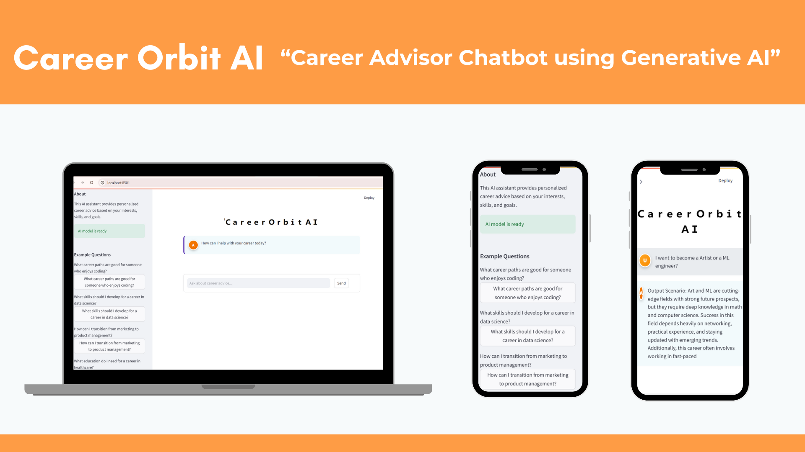
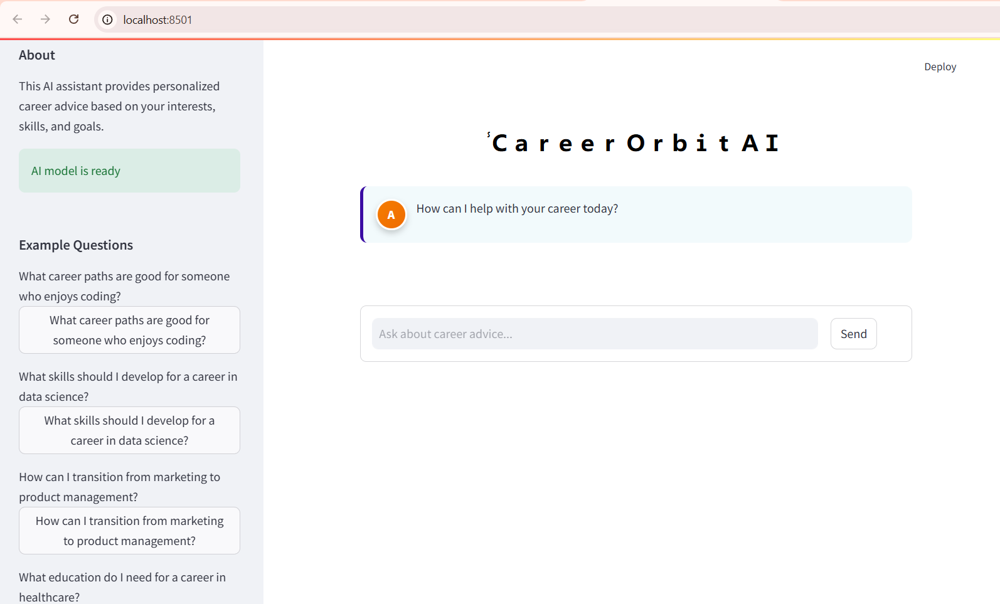
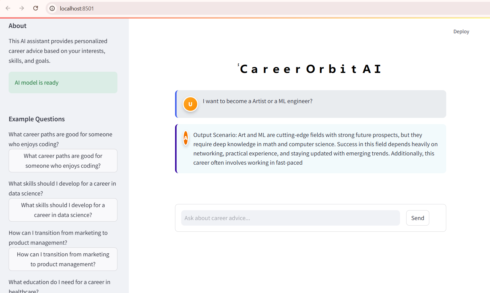
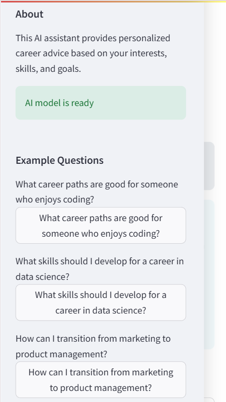
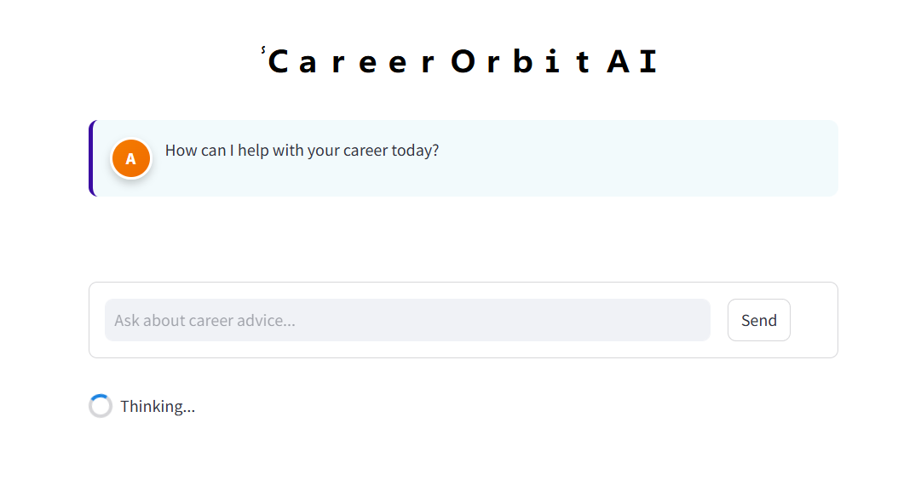

# Career Advisor Chatbot using Generative AI



A specialized Career Advisor Chatbot built with Generative AI that provides balanced insights on different career paths, highlighting both opportunities and challenges to help users make informed career decisions.

## 🌟 Features

- **Balanced Career Advice**: Get comprehensive perspectives on career options with both pros and cons
- **User-Friendly Interface**: Clean, intuitive Streamlit web application for easy interaction
- **Specialized Knowledge**: Fine-tuned on career-specific data to provide relevant guidance
- **Responsive Design**: Works well on both desktop and mobile devices

## 📊 Demo Screenshots

<details>
<summary>Click to view screenshots</summary>

### Main Interface


### Response Display


### Mobile View


### Processing State


</details>

## 🛠️ Technologies Used

- **Python**: Core programming language
- **HuggingFace Transformers**: For accessing and fine-tuning language models
- **PyTorch**: Deep learning framework for model training
- **GPT-Neo (125M)**: Base language model from EleutherAI
- **Pandas**: For data processing and manipulation
- **Chardet**: For encoding detection in dataset files
- **Streamlit**: Web application framework for the user interface
- **HTML/CSS**: For UI styling and enhancements

## 📋 System Architecture

The Career Advisor Chatbot consists of three main components:

1. **Fine-tuned Language Model**: A GPT-Neo 125M model specialized in career advice
2. **Inference Engine**: Python code that processes queries and generates responses
3. **Web Interface**: A Streamlit application for user interaction

### Flow:
- User inputs a career question via the Streamlit interface
- The query is processed by the inference engine
- The fine-tuned model generates a relevant response
- The response is formatted and displayed in the web interface

## 📥 Installation & Setup

### Prerequisites
- Python 3.7+
- PyTorch
- CUDA-compatible GPU (recommended but not required)

### Setup Steps

1. Clone the repository:
```bash
git clone [https://github.com/SUSHIL-0711/Career-Advisor-Chatbot.git]
cd career-advisor-chatbot
```

2. Install dependencies:
```bash
pip install -r requirements.txt
```

3. Download the fine-tuned model:

## 📂 Download Model
Download the 125M model manually: [Google Drive Link](https://drive.google.com/drive/folders/1ZEGH_4UeJ7ufNe0thDtJl4UkyiIgELYY?usp=sharing)

Extract the model files to a directory named `career_GPT_advisor_chatbot_125m_model` in the project root.

4. Run the application:
```bash
streamlit run app.py
```

## 💻 Usage

1. Start the Streamlit application
2. Enter your career-related question in the text area
3. Click "Get Career Advice"
4. View the generated balanced advice about your career options

## 📊 Training Results

The model was trained for 5 epochs with the following training loss pattern:

```
Step 100    Training Loss    1.026300
Step 200    Training Loss    0.256300
Step 300    Training Loss    0.198200
Step 400    Training Loss    0.181900
Step 500    Training Loss    0.148900

Final training loss: 0.3520356205531529
```

## 🧠 Implementation Details

### Dataset Creation

The project uses a custom dataset named "Career_Decision_Dataset.csv" containing paired career-related queries and comprehensive responses. The dataset structure follows an "Input Prompt" and "Output Scenario" format:

- **Input Prompt**: Contains user questions about specific careers or career aspects
- **Output Scenario**: Provides balanced responses detailing both pros and cons of careers

### Model Selection and Fine-tuning

For this project, we selected EleutherAI's GPT-Neo 125M as our base model due to its balance of performance and resource requirements. The fine-tuning process included:

- Loading the pre-trained GPT-Neo model and tokenizer
- Setting appropriate tokenization parameters (max length: 256 tokens)
- Configuring the training arguments (5 epochs, gradient accumulation)
- Fine-tuning the model on our career advice dataset
- Saving the fine-tuned model for inference

### Code Structure

- `fine_tune.py`: Script for fine-tuning the GPT-Neo model
- `app.py`: Streamlit web application for the user interface
- `inference.py`: Standalone script for model inference
- `requirements.txt`: Dependencies for the project
- `Career_Decision_Dataset.csv`: Training dataset (not included in repo)

## 🌐 Sample Output

**User Query:**
```
I want to become an Artist or an ML engineer?
```

**Generated Response:**
```
Output Scenario: Art and ML are cutting-edge fields with strong future prospects, but they require deep knowledge in math and computer science. Both fields offer creative expression and problem-solving opportunities, while demanding continuous learning. Art offers more independence but less financial stability, while ML engineering typically provides better compensation but in more structured environments.
```

## 🚀 Future Improvements

- Expand the dataset with more career options and specialized advice
- Implement larger models for more nuanced responses
- Add career assessment questionnaires for personalized advice
- Implement search functionality to find specific career information
- Add multilingual support for global accessibility

## 📚 References

- HuggingFace Transformers Documentation
- EleutherAI GPT-Neo research and documentation
- Fine-tuning techniques for language models
- Career counseling frameworks and best practices
- Similar NLP projects on conversational AI systems

## 📄 License

This project is licensed under the MIT License - see the [LICENSE](LICENSE) file for details.

## 🤝 Contributing

Contributions are welcome! Please feel free to submit a Pull Request.

## 📧 Contact

For questions or feedback, please open an issue in this repository or contact [sushilshetty0711@gmail.com].
